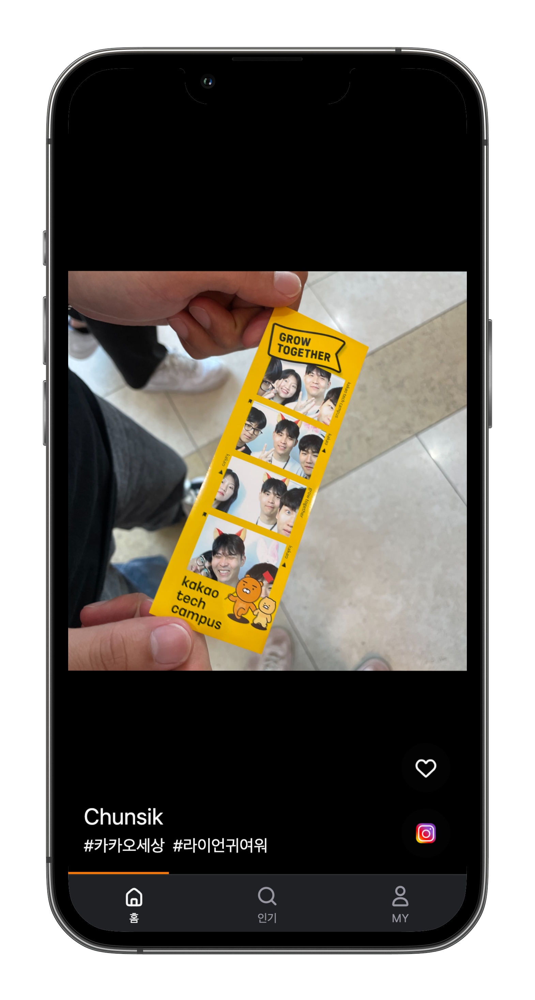
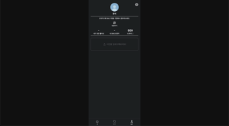

# 카카오 테크 캠퍼스 3단계 과제: 축팅

<div style="display: flex; justify-content: center;" align="center">
  
  
  
</div>

포토부스의 사진을 공유하고, 만남을 연결하는 서비스 **축팅**입니다.

<br />

## 🏁 시작하기

23년 11월 말부터 [배포 주소](https://k2bf481c846ffa.user-app.krampoline.com/)는 동작하지 않습니다.

<br />

## 👋 팀 소개

프론트엔드 3인, 백엔드 4인으로 이루어진 7인 팀 SPARK 입니다.

### FE

<table>
  <tr>
    <td align="center"><a href="https://github.com/MINJOO-KIM"></a></td>
    <td align="center"><a href="https://github.com/GhoRid"></a></td>
    <td align="center"><a href="https://github.com/iam454"></a></td>
  </tr>
  <tr>
    <td align="center"><a href="https://github.com/MINJOO-KIM">김민주(MINJOO-KIM)</a></td>
    <td align="center"><a href="https://github.com/GhoRid">박건형(GhoRid)</a></td>
    <td align="center"><a href="https://github.com/iam454">서완석(iam454)</a></td>
  </tr>
  <tr>
    <td align="center">리액셔너</td>
    <td align="center">기획리더</td>
    <td align="center">테크리더</td>
  </tr>
<table>

### BE

<table>
  <tr>
    <td align="center"><a href="https://github.com/GoBeromsu"></a></td>
    <td align="center"><a href="https://github.com/yuseonkim"></a></td>
    <td align="center"><a href="https://github.com/SongGaEun16"></a></td>
    <td align="center"><a href="https://github.com/hwangdaesun"></a></td>
  </tr>
  <tr>
    <td align="center"><a href="https://github.com/GoBeromsu">고범수(GoBeromsu)</a></td>
    <td align="center"><a href="https://github.com/yuseonkim">김유선(yuseonkim)</a></td>
    <td align="center"><a href="https://github.com/SongGaEun16">송가은(SongGaEun16)</a></td>
    <td align="center"><a href="https://github.com/hwangdaesun">황대선(hwangdaesun)</a></td>
  </tr>
  <tr>
    <td align="center">테크리더</td>
    <td align="center">타임키퍼</td>
    <td align="center">리마인더</td>
    <td align="center">조장</td>
  </tr>
<table>

<br />

## 🧐 프로젝트 소개

개발 기간 : 2023년 8월 25일 ~ 2023년 11월 11일

카카오 테크 캠퍼스(이하 카테캠) 3단계 과제 수행 프로젝트 중 FE 개발을 다루고 있습니다.

기획부터 배포까지 서비스 개발에 필요한 전반적인 과정을 경험했습니다.

### 📝 기획

축팅은 네컷사진을 중심으로 한 만남의 플랫폼입니다.

남성 사용자가 많은 데이팅 앱 시장의 문제점을 해결하기 위해 여성 사용자가 많은 네컷사진 시장을 접목시켰습니다.

사용자는 네컷사진을 게시하고, 축팅의 재화인 폭죽을 사용하여 마음에 드는 상대의 인스타그램에 방문할 수 있습니다.

- [기획안 발표 자료(PowerPoint) 다운로드](https://drive.google.com/file/d/1NsLP3KFZE2CUSgwqEm7uGOyySQEIONOg/view?usp=sharing)

### 🎨 디자인

일관된 경험을 제공하기 위해 4배수 디자인을 적용했습니다.

서비스의 주요 타겟인 모바일 사용자를 위해 Thumb Zone을 고려했습니다.

행동을 유도하기 위해 Affordance에 대해 고민했습니다.

- [와이어프레임(Figma) 보러가기](https://www.figma.com/file/n1fenCQYDfghtHT2Qua0YL/kakao14WireBoard?type=design&node-id=0%3A1&mode=design&t=oSx3LovlAi3IIcv2-1)

### 🖥️ 화면 및 기능

#### 1️⃣ 홈 페이지

<div style="display: flex; justify-content: center; gap: 16px;" align="center">
  
  
  
</div>

- 숏폼 형식으로 콘텐츠를 제공합니다.
- 일시정지 및 재생이 가능합니다.

#### 2️⃣ 카카오 로그인/로그아웃, 회원 탈퇴

<div style="display: flex; justify-content: center; gap: 16px;" align="center">
  
  
</div>

- 카카오 로그인을 통해 제한된 서비스를 이용할 수 있습니다.
- 로그아웃과 탈퇴가 가능합니다.

#### 3️⃣ 인스타그램 연결

<div style="display: flex; justify-content: center; gap: 16px;" align="center">
  
</div>

- 인스타그램 연결을 통해 모든 서비스를 이용할 수 있습니다.

#### 4️⃣ 좋아요

<div style="display: flex; justify-content: center; gap: 16px;" align="center">
  
  
</div>

- 빈 하트 아이콘을 누르거나 화면을 빠르게 두 번 눌러 게시물에 좋아요를 남길 수 있습니다.
- 채워진 하트 아이콘을 누르는 것으로 좋아요를 취소할 수 있습니다.

#### 5️⃣ 인스타그램 방문

<div style="display: flex; justify-content: center; gap: 16px;" align="center">
  
</div>

- 축팅의 재화인 폭죽을 사용하여 게시물 작성자의 인스타그램에 방문할 수 있습니다.

#### 6️⃣ 인기 페이지

<div style="display: flex; justify-content: center; gap: 16px;" align="center">
  
  
  
</div>

- Masonry Layout의 형식으로 여러 게시물을 볼 수 있습니다.
- 게시물의 크기는 인기도가 높을수록 커지고, 폭죽의 비용도 커집니다.
- 게시물의 인기도는 세 단계로 나뉩니다.

#### 7️⃣ 마이 페이지

<div style="display: flex; justify-content: center; gap: 16px;" align="center">
  
  
</div>

- 내 정보(로그인한 계정, 인스타 연결 유무, 받은 좋아요 수, 인스타그램 방문자 수, 보유 폭죽)를 확인할 수 있습니다.
- 게시물을 업로드할 수 있습니다.
- 업로드한 게시물의 정보를 확인할 수 있습니다.

#### 8️⃣ 게시물 업로드

<div style="display: flex; justify-content: center; gap: 16px;" align="center">
  
  
</div>

- 사진, 이름, 해시태그(선택, 최대 2) 정보를 입력하여 게시물을 업로드할 수 있습니다.
- 화면에 나타난 해시태그를 누르는 것으로 작성된 내용을 삭제할 수 있습니다.

<br />

## ⚙️ 기술 스택

### Config


### Development

<div style="display: flex; gap: 4px;">
  
  
  
  
  
  
  
  
  
</div>

<br />

# 주차별 과제 내용

<details>
  <summary>1주차(09.04 ~ 09.08)</summary>
  <div>

### ✅ 산출물

```
- 5 Whys
- 마켓 리서치
- 페르소나 & 저니맵
- 와이어프레임
- 칸반보드
```

  </div>
</details>

---

<details>
  <summary>2주차(09.11 ~ 09.15)</summary>
  <div>
  
### ✅ 산출물

```
- ERD 설계서
- API 명세서
```

  </div>
</details>

---

<details>
  <summary>3주차(09.18 ~ 09.22)</summary>
  <div>
  
### ✅ 산출물

```
- 기획안 발표
```

  </div>
</details>

---

<details>
  <summary>4주차(09.25 ~ 10.01)</summary>
  <div>
  
### ✅ 산출물

```
민주
- 게시물 Skeleton UI 생성

건형
- 모달 생성

완석
- 개발 환경 설정
- 스타일 초기화 및 폰트, 색상 결정
- 페이지 경로 설정 및 내비게이션 바 생성
- 공통 컴포넌트 생성
- 인기 페이지 UI 임시 생성
```

### ❓ 멘토링 질문

**건형, GhoRid**

1. 컴포넌트를 만들 때, 재사용성을 고려하면 컴포넌트에 받을 props가 너무 많아지는 걸 느꼈습니다. 예를 들어, 모달창 하나를 만드려면 모달창을 열고 닫는 함수, 모달창이 열려있는 상태, 모달창 텍스트, 버튼 함수, 버튼에 들어갈 텍스트(버튼이 2개면 두 개), 버튼 색상, 버튼 아이콘 등... 재사용성을 확보하려면 전달할 props가 워낙 많아지니 이런저런 상황에 활용할 수 있도록 만든 컴포넌트를 처음부터 알아서 만드는 느낌이 강해지는 터라 이에 대해 헷갈립니다. 커스텀을 어디까지 허용해야 할까요?

2. 현재 모달은 modalType이라는 변수에 따라 switch문으로 색상 및 텍스트를 변경할 수 있게 했습니다. modalType만 지정하여 props에 넘겨주면 미리 지정한 switch를 통해 알아서 스타일링이 바뀌게 됩니다. 새로운 상황이 생기면 switch문에 case를 추가하여 처리할 수 있습니다. case를 추가하여 스타일링을 확장하도록 하는 방식은 어떻게 생각하시나요? (코드 리뷰 후 이 방식이 안 좋다는 걸 느껴서 현재는 색상, 텍스트 등을 props로 받아서 직접 지정할 수 있도록 바꿀 예정입니다.)

3. 개발 첫 주를 진행하면서 코드 리뷰의 중요성을 몸소 깨달았습니다. 자주 소통하지 않으면 방향성이 틀어지는 걸 늦게 캐치하여 큰 수정이 필요하게 됩니다. 현업에서는 코드 리뷰의 주기가 어떻게 되나요?

**완석, iam454**

1️⃣ 코드 리뷰에 대한 조언을 여쭙고자 합니다.

저희 팀은 weekly 브랜치에 PR을 보내고 1명 이상의 리뷰 후 merge하는 방식을 채택했습니다. 놓친 부분을 리뷰를 통해 잡거나 직접 개발하지 않은 부분도 어느 정도 이해할 수 있게 되어서 장점을 느꼈지만, 단점 역시 느끼고 있습니다. 개발 첫 주동안 느낀 불편한 점은 다음과 같습니다.

- 같이 배우는 입장이기 때문에, 누가 더 좋은 방향성을 가진 코드인지 판단하기 어렵습니다.
- 리뷰의 과정이 감정을 상하게 할 수도 있을 것 같아 굉장히 조심스럽습니다.
- UI 관련 내용은 merge 이전에 화면으로 볼 수 없습니다.

코드 리뷰는 적절하게 이루어지고 있는지([예시1](https://github.com/Step3-kakao-tech-campus/Team14_FE/pull/12), [예시2](https://github.com/Step3-kakao-tech-campus/Team14_FE/pull/13)), 불편점을 완화해줄 꿀팁이 있는지 궁금합니다.

2️⃣ 디렉토리 구조에 대한 생각이 궁금합니다.

이 프로젝트는 다음과 같은 구조로 수행될 것 같습니다. 정답이 있는 문제는 아니겠지만 현업에서 자주 사용되는 방식이 있는지, 멘토님이 추천하시는 어떤 방식이 있는지 궁금합니다.

```
my-app
├── node_modules
├── public
│   ├── index.html
│   ├── favicon.ico
│   └── manifest.json
├── src
│   ├── api
│   │   ├── index.js
│   │   └── ... (다른 API 관련 파일들)
│   ├── components
│   │   ├── CommonComponent1
│   │   ├── CommonComponent2
│   │   └── ... (다른 공통 컴포넌트들)
│   ├── lib
│   │   ├── index.js
│   │   └── ... (다른 라이브러리 관련 파일들)
│   ├── pages
│   │   ├── Page1
│   │   │   ├── components
│   │   │   │   ├── Page1Component1
│   │   │   │   ├── Page1Component2
│   │   │   │   └── ... (다른 페이지 1의 컴포넌트들)
│   │   │   └── Page1.js (or Page1.jsx)
│   │   ├── Page2
│   │   │   ├── components
│   │   │   │   ├── Page2Component1
│   │   │   │   ├── Page2Component2
│   │   │   │   └── ... (다른 페이지 2의 컴포넌트들)
│   │   │   └── Page2.js (or Page2.jsx)
│   │   └── ... (다른 페이지들)
│   ├── utils
│   │   ├── index.js
│   │   └── ... (다른 유틸리티 함수들)
│   ├── App.js
│   ├── index.js
│   └── ...
├── package.json
├── package-lock.json
└── ...
```

3️⃣ 이미지 파일 관리는 어디서 하는게 좋나요?(public vs src/assets)

이미지 파일은 public 폴더 혹은 src 폴더의 하위로 관리하는 것 같습니다(구글링). 그런데 제 수준에서는 어떤 폴더를 선택하는 것이 좋은지 잘 와닿지가 않습니다. 멘토님께서는 어떤 기준으로 어떤 방식을 선택하여 이미지 파일을 관리하나요? 추천해주시는 방식이 있나요?(아이콘(svg)과 로고(png or svg) 정도가 관리될 것 같습니다.)

4️⃣ 현업에서 라이브러리는 자주 사용되나요? 라이브러리의 선택 기준에는 어떤 것이 있나요?

  </div>
</details>

---

<details>
  <summary>5주차(10.02 ~ 10.08)</summary>
  <div>
  
### ✅ 산출물

```
민주
- 홈 페이지 Swiper 적용

건형
- 마이 페이지 UI 생성

완석
- 게시물 Skeleton UI 리팩토링
- 모달 리팩토링(react-modal 적용)
- 게시물 UI 생성
- 인기 페이지 UI 생성
- 인기 페이지 게시물 상세 조회 UI 생성
- 게시물 좋아요 애니메이션 생성
- 설정 페이지 생성
- 홈 페이지 Swiper 적용
- 홈 페이지 게시물 time progress bar 기능 생성
- 홈 페이지 게시물 pause/resume 기능 생성
```

### ❓ 멘토링 질문

**완석, iam454**

1️⃣ 클릭 이벤트와 더블클릭 이벤트의 구분

멘토링 시간 때 질문 드렸던 것과 동일합니다. 좀 더 연구해보겠습니다.

  </div>
</details>

---

<details>
  <summary>6주차(10.09 ~ 10.15)</summary>
  <div>
  
### ✅ 산출물

```
민주
- 업로드 완료 페이지 임시 생성

건형
- 마이 페이지 게시물 상세 조회 페이지 생성
- 업로드 선택 페이지 임시 생성

완석
- 홈 페이지 클릭/더블클릭 이벤트 이슈 해결
- 마이 페이지 리팩토링
- 마이 페이지 이미지 파일 업로드 기능 생성
- 업로드 페이지 임시 생성
```

  </div>
</details>

---

<details>
  <summary>7주차(10.16 ~ 10.22)</summary>
  <div>
  
### ✅ 산출물

```
민주
- 업로드 완료 페이지 리팩토링

건형
- 업로드 선택 페이지 리팩토링

완석
- 404 페이지 생성
- 시맨틱 태그 적용
- API 연결 준비
```

  </div>
</details>

---

<details>
  <summary>8주차(10.23 ~ 10.29)</summary>
  <div>

8주차는 중간고사 기간으로 자율적으로 개발했습니다.

### ✅ 산출물

```
- 완석
카카오 로그인 API 임시 연결
홈 전체 조회 API 임시 연결
인기 전체 조회 API 연결 및 무한 스크롤 구현
인기 상세 조회 API 연결
좋아요 API 연결
업로드 API 연결
인스타그램 연결 로직 임시 생성
로그아웃 API 임시 연결
로그인 여부에 따른 접근 제한(로그인) 모달 생성
MY 계정 정보 조회 API 임시 연결
MY 전체 조회 API 임시 연결 및 무한 스크롤 구현
MY 상세 조회 API 임시 연결
```

  </div>
</details>

---

<details>
  <summary>9주차(10.30 ~ 11.05)</summary>
  <div>
  
### ✅ 산출물

```
- 건형
로그인 여부에 따른 레이아웃 생성
MY 페이지 관련 에러 처리

- 완석
카카오 로그인
인스타그램 연결
로그아웃
회원탈퇴
favicon 및 오픈그래프
```

  </div>
</details>

---

<details>
  <summary>10주차(11.06 ~ 11.12)</summary>
  <div>
  
### ✅ 산출물

```
- 민주
홈 무한스크롤

- 건형
MY 무한스크롤

- 완석
홈 무한스크롤
MY 무한스크롤
전체 코드 정리 및 기능 확인
크램폴린 배포
```

  </div>
</details>
